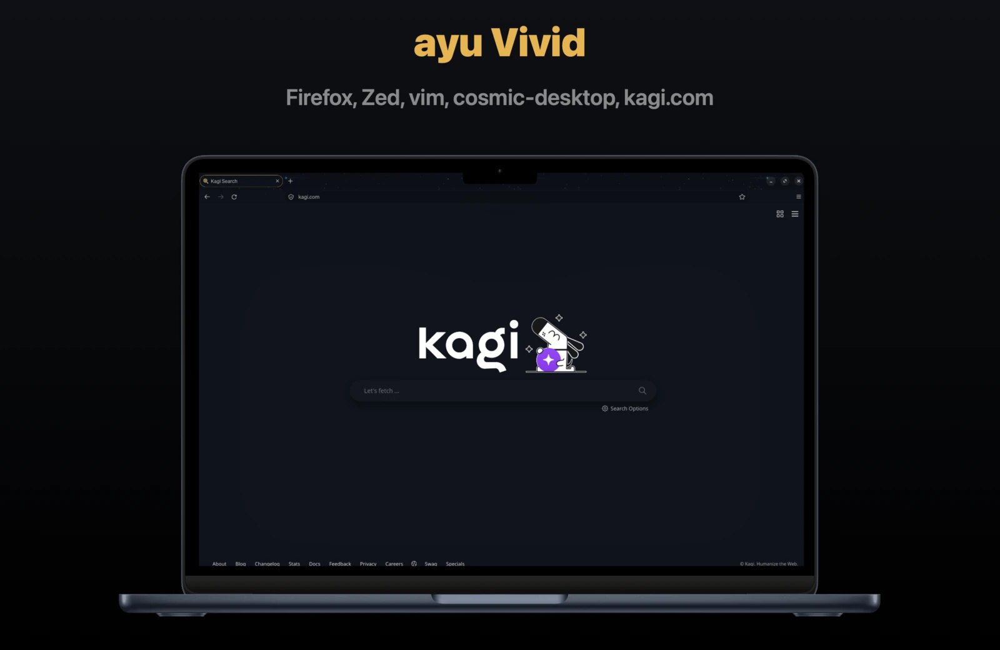
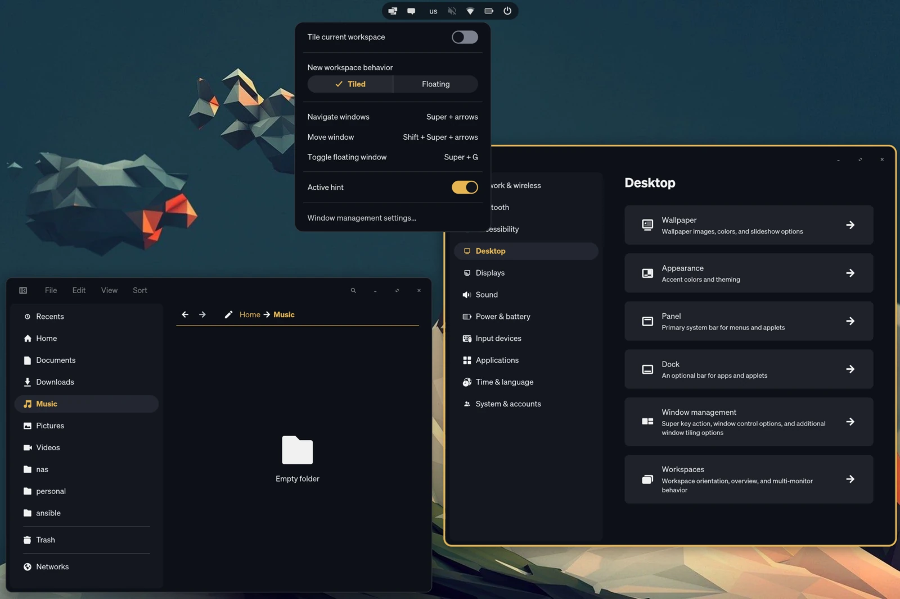
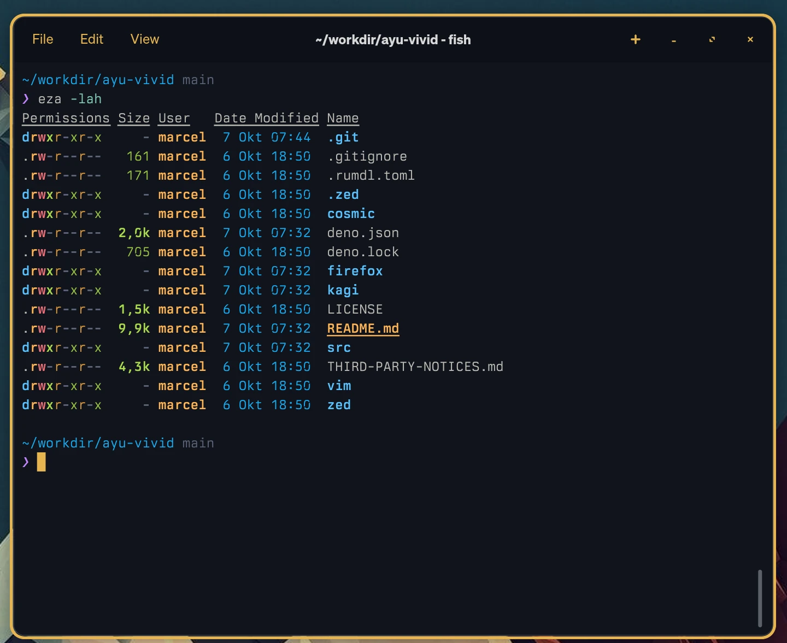
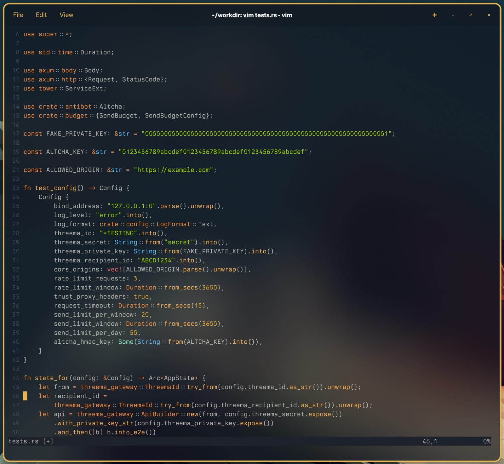
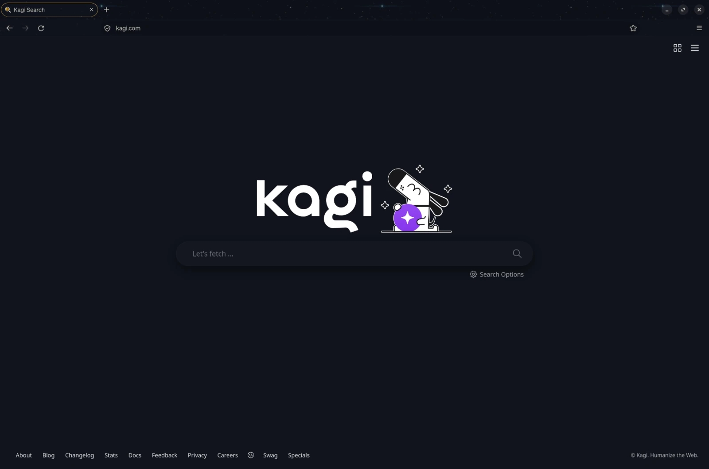

# ayu Vivid

> **A personal note:** all credit goes to [Ike Ku](https://github.com/dempfi), who created
> [ayu](https://github.com/dempfi/ayu), to me the most beautiful theme there is. This repository only carries his colors
> into a few more apps.



The ayu color theme for several apps, all generated from the [`ayu`](https://www.npmjs.com/package/ayu) palette package
so they stay in sync. Syntax colors are tuned in the Zed theme, and the other ports take their colors from it.

```text
src/        generators, one module per port (shared.ts has the color helpers)
zed/theme/  Zed extension "ayu Vivid": Dark / Mirage / Light color themes
zed/icons/  Zed extension "ayu Vivid Icons": file icon theme
cosmic/     COSMIC desktop theme + COSMIC Terminal colors (ayu Vivid Dark)
vim/        Vim / Neovim colorscheme (ayu Vivid Dark)
firefox/    Firefox / LibreWolf theme (ayu Vivid Dark + animated stars)
chromium/   Helium / Chrome / Brave / Vivaldi theme (ayu Vivid Dark + still stars)
kagi/       Custom CSS for the Kagi search engine (ayu Vivid Light + Dark)
```

Files in the port folders are generated. Don't edit them by hand; change `src/` and rebuild.

## Build

Requires [Deno](https://deno.com) 2.

```sh
deno task build
```

`build` first lints the Markdown files with [rumdl](https://github.com/rvben/rumdl) (`deno task md`) and stops if it
finds issues. `deno task md-fix` fixes them, including wrapping long lines.

Options, passed after the task name:

- `--vivid=<factor>`: syntax saturation boost in OKLCH (lightness and hue stay the same). Default `1.2`; `1` is the
  plain palette. Example: `deno task build --vivid=1.1`.
- `--p3`: Zed only. Zed on macOS doesn't color-manage theme colors, so on P3 screens (most Macs) the palette looks more
  saturated than in color-managed apps. That vivid look is the default; `--p3` re-encodes colors to show the exact,
  calmer sRGB values.

### Adding a port

Create `src/<port>.ts` with a `build()` function that writes into `<port>/` (use `writeText` / `writeJson` from
`shared.ts`) and returns a one-line summary. Then add it to the list in `src/build.ts` and to `--allow-write` in the
`build` task in `deno.json`. To reuse the tuned colors, take them from the Zed theme: `theme(ayu.dark, 'dark')` from
`zed.ts`.

## Zed

The color themes and the icons are two separate extensions, as Zed's registry requires. Install either or both:

1. In Zed, open the command palette and run `zed: install dev extension`.
2. Select `zed/theme/` (color themes) or `zed/icons/` (icons). Repeat for the other one.
3. Pick the theme with `theme selector: toggle` and the icons with `icon theme selector: toggle`.

After rebuilding, run `zed: rebuild dev extension` (or reinstall it) to pick up changes.

> **About the icons:** 85 of the 136 ayu file icons only exist as small PNGs, and Zed icon themes need SVG. 83 of them
> are replaced with SVGs from open icon collections (gilbarbara/logos, Simple Icons, vscode-icons, Material Icon Theme),
> so some logos look different from ayu in VS Code. Only `tern` (Tern.js) is still a PNG inside an SVG and looks a bit
> soft.
>
> To use a different icon, save an SVG as `src/icons/<name>.svg`, using the same name as the file it replaces (e.g.
> `lua.svg`, `R.svg`), add a row to `src/icons/SOURCES.md` and rebuild. `deno task icons-fetch` fills in missing icons
> without touching existing ones (needs ImageMagick), and `deno task icons-compare` opens a page comparing the upstream
> ayu icons with the Zed ones.

Notes:

- Zed uses tree-sitter captures instead of TextMate scopes, so the syntax mapping in `src/zed.ts` approximates the
  original ayu Sublime color scheme rather than copying it rule for rule.

## COSMIC

`cosmic/` has a desktop theme and a terminal color scheme, both from **ayu Vivid Dark**. The desktop theme is also on
[cosmic-themes.org](https://cosmic-themes.org/376/).





- **Desktop:** open Settings → Desktop → Appearance, switch to Dark, click **Import** and pick
  `cosmic/ayu-vivid-dark.ron`.
- **Terminal:** in COSMIC Terminal, open Settings → Color schemes, click **Import** and pick
  `cosmic/ayu-vivid-dark-terminal.ron`, then select **ayu Vivid Dark**.

The terminal colors are the same values the Zed theme uses.

## Vim / Neovim

Copy `vim/ayu-vivid-dark.vim` to `~/.vim/colors/` (Vim) or `~/.config/nvim/colors/` (Neovim), then run
`:colorscheme ayu-vivid-dark`. It uses truecolor and falls back to the nearest 256 colors.



## Firefox / LibreWolf

**ayu Vivid Space**: ayu Vivid Dark colors over animated stars, for Firefox 140+ and LibreWolf.



**Recommended:** install it from
[addons.mozilla.org](https://addons.mozilla.org/firefox/addon/ayu-vivid-space/). One click, and it updates
automatically.

For offline installs or other machines, each [release](https://github.com/tofulupo/ayu-vivid/releases) also has the
signed `ayu-vivid-space-<version>.xpi`, the same file Mozilla serves. Drag it into a browser window, or use
`about:addons` → gear menu → **Install Add-on From File**. It's signed by Mozilla, so it installs with signature
checking on.

**Orion** (Kagi's browser) installs the theme but ignores it: no colors and no animation. The [Kagi](#kagi) CSS works
there as usual.

### Alternative: userChrome.css

This installs the theme as CSS in your browser profile instead of as an add-on. It's handy for testing changes from
this repository.

1. Install the files into your profile, either from this repository or from the `ayu-vivid-space.zip` of a
   [release](https://github.com/tofulupo/ayu-vivid/releases) (only needs `sh`):

   ```sh
   deno task firefox-chrome                  # from this repository
   sh ayu-vivid-space/install.sh             # from the unzipped release
   ```

   Without arguments it uses LibreWolf's default profile (macOS, Linux, Flatpak). For Firefox or another profile, add
   the folder from `about:support` → Profile Folder, e.g. `deno task firefox-chrome "<profile dir>"`. It never
   overwrites a `userChrome.css` or `userContent.css` it didn't create.
2. In `about:config`, set `toolkit.legacyUserProfileCustomizations.stylesheets` to `true`. This only lets the browser
   load CSS from your own profile folder.
3. In `about:addons` → Themes, enable the built-in **Dark** theme. The CSS overrides its colors.
4. Restart the browser.

After `deno task build`, run `deno task firefox-chrome` again and restart.

### Uninstall

```sh
deno task firefox-chrome-uninstall        # from this repository
sh ayu-vivid-space/install.sh --uninstall # from the unzipped release
```

Pass a profile folder the same way as when installing. It only removes the files it installed; your own
`userChrome.css`/`userContent.css` and anything else in `chrome/` stay. Then restart the browser. Optionally set the
`about:config` setting from step 2 back to `false` and pick another theme in `about:addons`.

Before switching to the add-on from addons.mozilla.org, uninstall the CSS version; otherwise it overrides the add-on's
colors.

### Development

- **Animation:** made from [Animation Of Stars](https://vimeo.com/379631605) by Play (CC BY 3.0), see
  [`firefox/CREDITS.md`](firefox/CREDITS.md). The source video is in `firefox/source/`, the finished
  `firefox/img/background.gif` is committed. To remake it, e.g. after changing the background color (needs ffmpeg):
  `deno task firefox-background`.
- **Release zip:** `deno task firefox-export` creates `firefox/ayu-vivid-space.zip` with the CSS, the GIF, `CREDITS.md`
  and `install.sh`. Keep `CREDITS.md` in it when sharing; the animation's license requires the attribution.
- **Add-on package:** `deno task firefox-pack` builds `firefox/ayu-vivid-space.xpi` for addons.mozilla.org. To test it
  unsigned until the next restart: `about:debugging` → This Firefox → **Load Temporary Add-on** →
  `firefox/manifest.json`.

## Helium / Chromium

**ayu Vivid Space** for Chromium browsers (Helium, Chrome, Brave, Vivaldi, Edge): the same colors as the Firefox theme,
with stars behind the tab strip and, dimmed, behind the toolbar.

Tested in Helium on macOS. Chrome, Brave, Vivaldi and Edge use the same theme format and should work too, but I can't
test them; if you use one of them, feedback (screenshots or problems) is welcome in the
[issues](https://github.com/tofulupo/ayu-vivid/issues).

Chromium themes only allow still images and fixed colors, so compared to Firefox:

- the stars don't move;
- the address bar's focus ring stays Chromium's blue, because themes can't change it.

To install:

1. Download `ayu-vivid-space-chromium.zip` from a [release](https://github.com/tofulupo/ayu-vivid/releases) and unzip
   it, or use the `chromium/` folder of this repository.
2. Open `chrome://extensions` and turn on **Developer mode**.
3. Click **Load unpacked** and select the folder. Keep the folder; the browser loads the theme from there.

To remove it, go to Settings → Appearance and click **Reset to default**.

### Development

- **Images:** `chromium/img/frame.png` (tab strip) and `chromium/img/toolbar.png` (toolbar) are a still frame of the
  Firefox animation. Remake them with `deno task chromium-background` after `deno task firefox-background`. The
  toolbar dimming is `TOOLBAR_TINT` in `src/chromium-background.ts`.
- **Release zip:** `deno task chromium-pack` creates `chromium/ayu-vivid-space-chromium.zip` with the manifest, images
  and `CREDITS.md`.

## Kagi

`kagi/ayu-vivid.css` styles the [Kagi](https://kagi.com) search engine, light and dark in one file. It's also listed on
[openkagi.com](https://openkagi.com/themes/ayu-vivid). Paste its contents into Settings → Appearance → **Custom CSS**
and turn on **Enable Custom CSS**. It follows Kagi's theme setting: ayu
Vivid Light with Kagi's light themes, ayu Vivid Dark with **Dark** or **Moon Dark**.

For the theme color (used for the browser toolbar on mobile), enter **`#fcfcfc`** for light and **`#10141c`** for dark,
the ayu page backgrounds. They're also noted at the top of the CSS file.

Result titles are blue (ayu's link color in dark), visited titles purple, and hover and active states use the ayu
yellow accent. Titles are only underlined on hover. In the light version, colors are darkened just enough to stay
readable on white (contrast of at least 4.5:1 for text, 3:1 for the large titles); hue and saturation are kept.

## License

BSD-3-Clause, see [`LICENSE`](LICENSE). Third-party parts keep their own licenses, listed in
[`THIRD-PARTY-NOTICES.md`](THIRD-PARTY-NOTICES.md) and [`firefox/CREDITS.md`](firefox/CREDITS.md).

## Credits

- Colors: [ayu](https://github.com/dempfi/ayu) by Ike Ku (MIT). Its license is included in
  [`THIRD-PARTY-NOTICES.md`](THIRD-PARTY-NOTICES.md).
- File icons: from the [`ayu`](https://www.npmjs.com/package/ayu) package. Replacements for its PNG-only icons come from
  [gilbarbara/logos](https://github.com/gilbarbara/logos) (CC0),
  [Simple Icons](https://github.com/simple-icons/simple-icons) (CC0),
  [vscode-icons](https://github.com/vscode-icons/vscode-icons) (MIT) and
  [Material Icon Theme](https://github.com/material-extensions/vscode-material-icon-theme) (MIT); per-icon list in
  [`src/icons/SOURCES.md`](src/icons/SOURCES.md), licenses in [`THIRD-PARTY-NOTICES.md`](THIRD-PARTY-NOTICES.md). Brand
  logos remain trademarks of their owners.
- Firefox and Chromium star background: [Animation Of Stars](https://vimeo.com/379631605) by Play,
  [CC BY 3.0](https://creativecommons.org/licenses/by/3.0/). Details in [`firefox/CREDITS.md`](firefox/CREDITS.md) and
  [`chromium/CREDITS.md`](chromium/CREDITS.md).
- Inspiration for the star themes: [Dark space](https://github.com/nicoth-in/Dark-Space-Theme) by Nicothin.
  No files from it are used.
